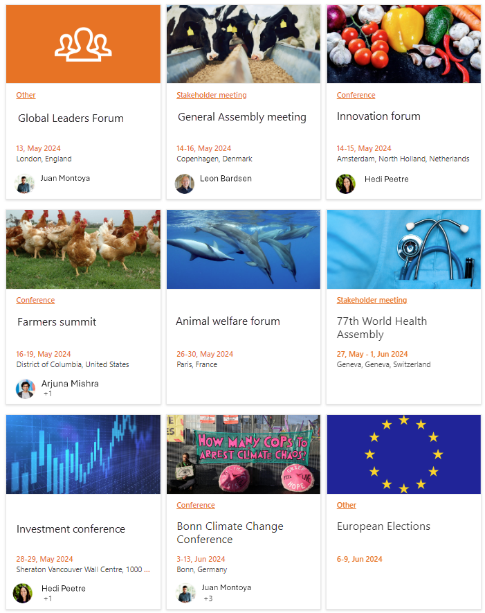

# Search Results for SharePoint Events
This template uses the reusable [pnp-documentcard](https://microsoft-search.github.io/pnp-modern-search/extensibility/web_components_list/#pnp-documentcard) web component to render items from a standard SharePoint Events list. The document card spaces have be reused to contain the event information including:
* Category
* Event date
* Event location
* Participants

## Event card search results


## Additional Properties required in `selected properties`
The following additional properies are needed in the search results:
* `BannerUrlOWSURLH`
* `EventsRollUpCategory`
* `EventsRollUpEndDate`
* `EventsRollUpStarteDate`
* `ListItemID`
* `Location`
* `ParticipantsPickerOWSUSER`
* `RefinableStringXXX` - optional property mapped to _ParticipantsPickerOWSUSER_ 

#### Optional LayoutSlots
| Slot name | Slot field | Description |
|:----------|:-----------|:------------|
| Author | `ParticipantsPickerOWSUSER` | Sets the Author value to the first participant of the event |
| Author | `RefineableStringXXX` | If the `ParticipantsPickerOWSUSER`  property has been mapped to a `RefinableStringXXX` propertiy, this will need to be used as the Slot field |

## Event participants
By default, any participants included in the event are included in the `ParticipantsPickerOWSUSER` property. However, this perpertiy is not optimised to handle multiple participants. If there is a need to show the number of additional people attending the event - e.g. Jo Bloggs +2 - the following steps are required:
* Map the `ParticipantsPickerOWSUSER` property to a suitable `RefinableStringXXX` Managed Property
* Add the `RefinableStringXXX` used to the `selected properties`
* Update the `Author` slot to the selected RefinableString


## Additional notes
* If the event has no banner image, a default embded SVG image using the SharePoint theme accent colors is used. 
* The category link relies on the `EventsRollUpCategory` property bing using within a refiner webpart

## Document card element - event card mapping
| pnp-documentcard | Event element | 
|:-----------------|:-----------|
| data-location | `EventsRollUpCategory`|
| data-title | `Title` |
| data-tags | Date & `Location` |
| data-preview-image | `BannerUrlOWSURLH` |
| data-preview-url | `SPSiteURL`/_layouts/15/Event.aspx?ListGuid=`ListId`&ItemId=`ListItemID` |
| data-href | `SPSiteURL`/_layouts/15/Event.aspx?ListGuid=`ListId`&ItemId=`ListItemID` !
| data-author | `ParticipantsPickerOWSUSER` |
| data-profile-image | `ParticipantsPickerOWSUSER` |
| data-date | number of additional participants |

## Query template suggestion
List all Events on the current site (make sure to select the properties listed above).

```{searchTerms} Path:{Site} contentclass:"STS_ListItem_Events"```

👉 If you want to filter the Events to a specific category, add refinement filter: `EventsRollUpCategory: "Category value"`

## Results template (rendering template)
The custom template is built on HTML and CSS and uses the [pnp-documentcard](https://microsoft-search.github.io/pnp-modern-search/extensibility/web_components_list/#pnp-documentcard) web component. No additional plugins or libraries are needed.

```html
<content id="data-content">
    <style>
        /* Assign the correct size % ratio according to the number of wanted cards on a single row. We use flexbox instead of static grid to deal with SharePoint canvas sections*/
        .template--card {
            flex-grow: 1;
            flex-shrink: 1;
            min-width: 206px; /* Min width of the Office UI Fabric document card */
            flex-basis: 33%; /* fix percentaage */
        }   
        /* Format the event location so that any overflow is managed appropriatly */
        .template--location {
            color: {{@root.theme.palette.bodyText}};
            overflow: hidden;
            text-overflow: ellipsis;
            white-space: nowrap;
            font-style: normal;
            font-weight: normal;
        }
    </style>

    <div class="template">

        {{#if @root.properties.showSelectedFilters}}
            <pnp-selectedfilters 
                data-filters="{{JSONstringify filters.selectedFilters 2}}" 
                data-filters-configuration="{{JSONstringify filters.filtersConfiguration 2}}" 
                data-instance-id="{{filters.instanceId}}" 
                data-operator="{{filters.filterOperator}}"
                data-theme-variant="{{JSONstringify @root.theme}}"
            >
            </pnp-selectedfilters>
        {{/if}}
       
        <div class="template--header">
            {{#if @root.properties.showResultsCount}}
                <div class="template--resultCount">
                    <label class="ms-fontWeight-semibold">{{getCountMessage @root.data.totalItemsCount @root.inputQueryText}}</label>
                </div>
            {{/if}}

            <div class="template--sort">
                <pnp-sortfield 
                    data-fields="{{JSONstringify @root.properties.dataSourceProperties.sortList}}" 
                    data-default-selected-field="{{sort.selectedSortFieldName}}" 
                    data-default-direction="{{sort.selectedSortDirection}}"
                    data-theme-variant="{{JSONstringify @root.theme}}">
                </pnp-sortfield>    
            </div>
        </div>

        <div class="template--cardContainer">
            {{#each data.items as |item|}}    
            
                {{#> resultTypes item=item}}
                    <pnp-documentcard class="template--card" 
                        data-ui-test-id="resultCard" 
                        data-item="{{JSONstringify item}}" 
                        data-location="&lt;a style=&quot;color:{{@root.theme.palette.themePrimary}};font-weight:600;font-family:'{{@root.theme.fonts.small.fontFamily}}'&quot; href=&quot;{{@root.context.site.serverRequestPath}}?f=[{%22filterName%22:%22EventsRollUpCategory%22,%22values%22:[{%22name%22:%22{{EventsRollUpCategory}}%22,%22value%22:%22{{EventsRollUpCategory}}%22,%22operator%22:0}]}]&quot;&gt;{{EventsRollUpCategory}}&lt;/a&gt;&lt;br&gt;"
                        data-tags="{{#if (lt (moment (getDate EventsRollUpEndDate) diff=(getDate EventsRollUpStartDate)) '86400000')}}{{getDate EventsRollUpStartDate 'D, MMM yyyy'}}{{else}}{{#if (eq (getDate EventsRollUpStartDate 'MM')(getDate EventsRollUpEndDate 'MM'))}}{{getDate EventsRollUpStartDate 'D'}}-{{else}}{{getDate EventsRollUpStartDate 'D, MMM'}}&nbsp;-&nbsp;{{/if}}{{moment (moment EventsRollUpEndDate utc=null) format='D, MMM yyyy'}}{{/if}}&lt;/br&gt;{{#if Location}}&lt;span class=&quot;template--location&quot;&gt;{{Location}}&lt;/span&gt;{{else}}&nbsp;{{/if}}"
                        data-title="{{slot item @root.slots.Title}}"
                        data-preview-image="{{#if BannerUrlOWSURLH}}{{BannerUrlOWSURLH}}{{else}}data:image/svg+xml,%3Csvg%20width%3D%2216000%22%20height%3D%229000%22%20xmlns%3D%22http%3A%2F%2Fwww.w3.org%2F2000%2Fsvg%22%3E%3Cdefs%3E%3ClinearGradient%20id%3D%22grad1%22%20x1%3D%220%25%22%20y1%3D%220%25%22%20x2%3D%22100%25%22%20y2%3D%22100%25%22%3E%3Cstop%20offset%3D%220%25%22%20style%3D%22stop-color%3A{{encodeURI @root.theme.palette.themeTertiary}}%3Bstop-opacity%3A1%22%20%2F%3E%3Cstop%20offset%3D%22100%25%22%20style%3D%22stop-color%3A{{encodeURI @root.theme.palette.themePrimary}}%3Bstop-opacity%3A1%22%20%2F%3E%3C%2FlinearGradient%3E%3C%2Fdefs%3E%3Crect%20width%3D%22100%25%22%20height%3D%22100%25%22%20fill%3D%22url%28%23grad1%29%22%20%2F%3E%3C%2Fsvg%3E{{/if}}" /* URI encoded inline svg image using the primary and tertiary theme colors to create a simple gradient to use when no banner image is used */
                        data-preview-url="{{#if ListItemID}}{{SPSiteURL}}/_layouts/15/Event.aspx?ListGuid={{slot item @root.slots.ListId}}&ItemId={{ListItemID}}{{/if}}" 
                        data-date="{{#if (gt (length (split (slot item @root.slots.Author) ';')) 1)}}&nbsp;+{{minus (length (split (slot item @root.slots.Author) ';')) 1}}{{/if}}" 
                        data-href="{{SPSiteURL}}/_layouts/15/Event.aspx?ListGuid={{slot item @root.slots.ListId}}&ItemId={{ListItemID}}" 
                        data-author="{{#if (slot item @root.slots.Author)}}{{slot item @root.slots.Author}}{{else}}&nbsp;{{/if}}" 
                        data-profile-image="{{#if (slot item @root.slots.Author)}}/_layouts/15/userphoto.aspx?size=L&username={{getUserEmail (slot item @root.slots.Author)}}{{else}}data:image/png;base64,iVBORw0KGgoAAAANSUhEUgAAAAEAAAABCAQAAAC1HAwCAAAAC0lEQVR42mNkYAAAAAYAAjCB0C8AAAAASUVORK5CYII={{/if}}"  /* 1 pixel transparent image created at https://png-pixel.com */
                        data-file-extension="docx"
                        data-enable-preview="true" 
                        data-is-container="false"
                        data-show-file-icon="false"
                        data-is-compact="false" 
                        data-context="{{JSONstringify (truncateContext @root)}}"
                        data-instance-id="{{@root.instanceId}}"
                        data-theme-variant="{{JSONstringify @root.theme}}"
                        data-allow-item-selection="{{@root.properties.itemSelectionProps.allowItemSelection}}"
                        data-item-key="{{@root.paging.currentPageNumber}}{{@index}}"                     
                        data-selected-keys="{{JSONstringify @root.selectedKeys}}"
                        data-index="{{@index}}"
                        >
                    </pnp-documentcard>
                {{/resultTypes}}

            {{/each}}

            <!-- Generate fake items to correctly align cards on rows using flexbox -->
            {{#times 3}}
                <pnp-documentcard 
                    class="template--card" 
                    data-ui-test-id="fakeCard"
                    data-theme-variant="{{JSONstringify @root.theme}}"
                    style="visibility:hidden;height: 0;padding: 0">
                </pnp-documentcard>
            {{/times}}
        </div>

        {{#if @root.properties.paging.showPaging}}

            {{#gt @root.data.totalItemsCount @root.properties.paging.itemsCountPerPage}}
                <pnp-pagination 
                    data-total-items="{{@root.data.totalItemsCount}}" 
                    data-hide-first-last-pages="{{@root.properties.paging.hideFirstLastPages}}"
                    data-hide-disabled="{{@root.properties.paging.hideDisabled}}"
                    data-hide-navigation="{{@root.properties.paging.hideNavigation}}"
                    data-range="{{@root.properties.paging.pagingRange}}" 
                    data-items-count-per-page="{{@root.properties.paging.itemsCountPerPage}}" 
                    data-current-page-number="{{@root.paging.currentPageNumber}}"
                    data-theme-variant="{{JSONstringify @root.theme}}"
                >
                </pnp-pagination>
            {{/gt}}
            
        {{/if}}

    </div>

</content>

<content id="placeholder-content">   

        <style>
            /* Assign the correct size % ratio according to the number of wanted cards on a single row. We use flexbox instead of static grid to deal with SharePoint canvas sections*/
            .template--card {
                flex-grow: 1;
                flex-shrink: 1;
                min-width: 206px; /* Min width of the Office UI Fabric document card */
                flex-basis: 33%;
            }    
        </style>

    <div class="placeholder">

        {{!-- #if showResultsCount --}}
        <div class="template--resultCount">
            <span class="placeholder--shimmer placeholder--line" style="width: 20%"></span>
        </div>
        {{!-- /if --}}
        <div class="template--cardContainer">

            {{#times @root.properties.paging.itemsCountPerPage}}
                <pnp-documentcardshimmers class="template--card" 
                    data-ui-test-id="fakeCard"
                    data-theme-variant="{{JSONstringify @root.theme}}"
                    data-is-compact="false">
                </pnp-documentcardshimmers>
            {{/times}}

            <!-- Generate fake items to correctly align cards on rows using flexbox -->
            {{#times 3}}
                <pnp-documentcard class="template--card" 
                    data-ui-test-id="fakeCard"
                    data-theme-variant="{{JSONstringify @root.theme}}"
                    style="visibility:hidden;height: 0;padding: 0">
                </pnp-documentcard>
            {{/times}}
        </div>

    </div>
</content>
```


